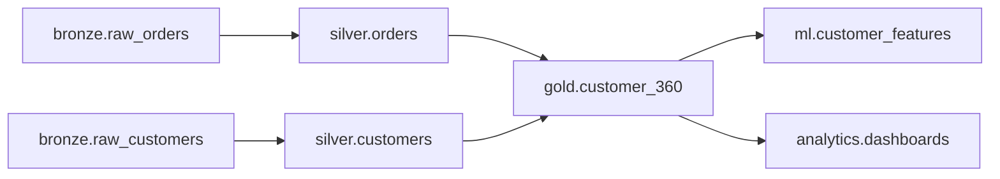

# Enforce Data Lineage Command

## Description
Track, visualize, and enforce data lineage across Unity Catalog with automated impact analysis, dependency tracking, and lineage validation for compliance and operational excellence.

## Usage
```bash
claude /databricks-governance:enforce-data-lineage [options]
```

## Examples

### Visualize Lineage for Table
```bash
claude /databricks-governance:enforce-data-lineage \
  --table production.gold.customer_360 \
  --direction both \
  --depth 5
```

### Impact Analysis Before Schema Change
```bash
claude /databricks-governance:enforce-data-lineage \
  --table production.silver.customers \
  --impact-analysis \
  --change-type "drop_column:email"
```

### Validate Lineage Completeness
```bash
claude /databricks-governance:enforce-data-lineage \
  --catalog production \
  --validate \
  --compliance-check gdpr
```

### Generate Lineage Documentation
```bash
claude /databricks-governance:enforce-data-lineage \
  --catalog production \
  --export-format mermaid \
  --output ./lineage-docs/
```

## What It Does

1. **Lineage Discovery**
   - Traces data from source to consumption
   - Captures column-level lineage
   - Tracks transformation logic
   - Identifies external dependencies

2. **Impact Analysis**
   - Simulates schema changes
   - Identifies downstream breakages
   - Calculates blast radius
   - Generates change impact reports

3. **Lineage Validation**
   - Verifies lineage completeness
   - Detects missing dependencies
   - Validates transformation accuracy
   - Ensures compliance with standards

4. **Visualization**
   - Creates interactive lineage graphs
   - Generates Mermaid diagrams
   - Produces dependency matrices
   - Exports lineage metadata

5. **Compliance Enforcement**
   - Validates data retention alignment
   - Checks consent propagation
   - Verifies deletion cascades (GDPR right to be forgotten)
   - Tracks sensitive data flow

## Lineage Types

### Table-Level Lineage


### Column-Level Lineage
```sql
-- Track how email column flows through pipeline
SELECT
  bronze.raw_customers.email_address AS source,
  silver.customers.email AS transformed,
  gold.customer_360.contact_email AS final
```

### Transformation Lineage
```python
# Capture transformation logic
lineage_metadata = {
    "source": "bronze.raw_orders",
    "target": "silver.orders",
    "transformations": [
        "deduplication on order_id",
        "date standardization",
        "currency conversion",
        "quality validation"
    ],
    "business_rules": [
        "exclude cancelled orders",
        "include orders with valid customer_id"
    ]
}
```

## Impact Analysis Examples

### Scenario 1: Drop Column
```bash
# Analyze impact of dropping email column
Table: production.silver.customers
Change: DROP COLUMN email

Impact Analysis:
✗ BREAKING: gold.customer_360 - depends on email for joins
✗ BREAKING: marketing.campaigns - uses email for targeting
✓ OK: analytics.revenue_reports - does not use email
✓ OK: ml.churn_model - uses email_hash (derived separately)

Recommendation: Do not drop. 2 downstream tables will break.
```

### Scenario 2: Change Data Type
```bash
# Analyze impact of changing order_date from STRING to DATE
Table: production.silver.orders
Change: ALTER COLUMN order_date TYPE DATE

Impact Analysis:
✓ OK: gold.daily_sales - already expects DATE
✓ OK: gold.monthly_revenue - handles both types
⚠ WARNING: legacy.sales_report - may have type mismatch
✗ BREAKING: external.data_share - contract specifies STRING

Recommendation: Coordinate with external consumers before change.
```

### Scenario 3: Table Deletion
```bash
# Analyze impact of dropping staging table
Table: staging.temp_customer_updates
Change: DROP TABLE

Impact Analysis:
✗ CRITICAL: production.silver.customers - depends on this table
✗ CRITICAL: jobs.customer_sync_job - reads from this table
✓ OK: No downstream gold tables depend on this

Recommendation: BLOCKED. Critical dependencies exist.
```

## Implementation

### Enable Lineage Capture
```sql
-- Enable Change Data Feed for lineage tracking
ALTER TABLE production.silver.customers
SET TBLPROPERTIES (
  delta.enableChangeDataFeed = true
);

-- Add lineage metadata tags
ALTER TABLE production.silver.customers
SET TAGS (
  'lineage.source' = 'bronze.raw_customers',
  'lineage.transformation' = 'deduplication_standardization',
  'lineage.owner' = 'data_engineering_team'
);
```

### Programmatic Lineage Tracking
```python
from databricks.sdk import WorkspaceClient
from typing import List, Dict, Set

class LineageTracker:
    def __init__(self):
        self.w = WorkspaceClient()

    def get_table_lineage(
        self,
        table_name: str,
        direction: str = "both",
        depth: int = 5
    ) -> Dict:
        """Get complete lineage for a table."""
        lineage = self.w.lineage.get_table_lineage(
            table_name=table_name,
            include_entity_lineage=True
        )

        result = {
            "table": table_name,
            "upstream": self._traverse_lineage(
                lineage.upstreams, depth
            ) if direction in ["upstream", "both"] else [],
            "downstream": self._traverse_lineage(
                lineage.downstreams, depth
            ) if direction in ["downstream", "both"] else []
        }

        return result

    def impact_analysis(
        self,
        table_name: str,
        change_type: str
    ) -> Dict:
        """Analyze impact of proposed change."""
        # Get all downstream dependencies
        lineage = self.get_table_lineage(
            table_name,
            direction="downstream"
        )

        impacted = {
            "breaking": [],
            "warning": [],
            "safe": []
        }

        for downstream in lineage["downstream"]:
            impact = self._analyze_change_impact(
                downstream,
                change_type
            )

            if impact["severity"] == "breaking":
                impacted["breaking"].append(downstream)
            elif impact["severity"] == "warning":
                impacted["warning"].append(downstream)
            else:
                impacted["safe"].append(downstream)

        return {
            "change": change_type,
            "table": table_name,
            "impacted": impacted,
            "recommendation": self._generate_recommendation(impacted)
        }

    def validate_lineage_compliance(
        self,
        catalog: str,
        standard: str = "gdpr"
    ) -> List[Dict]:
        """Validate lineage meets compliance requirements."""
        issues = []

        tables = self.w.tables.list(catalog_name=catalog)

        for table in tables:
            # Check if sensitive data has lineage
            if self._is_sensitive_table(table):
                lineage = self.get_table_lineage(table.full_name)

                # GDPR: Must track PII from source to destination
                if not lineage["upstream"]:
                    issues.append({
                        "table": table.full_name,
                        "issue": "Missing upstream lineage for PII data",
                        "severity": "high",
                        "standard": "GDPR Article 30"
                    })

                # GDPR: Must have deletion cascade path
                if not self._has_deletion_cascade(table.full_name):
                    issues.append({
                        "table": table.full_name,
                        "issue": "No deletion cascade defined (right to be forgotten)",
                        "severity": "critical",
                        "standard": "GDPR Article 17"
                    })

        return issues

    def generate_lineage_docs(
        self,
        catalog: str,
        output_format: str = "mermaid"
    ) -> str:
        """Generate lineage documentation."""
        if output_format == "mermaid":
            return self._generate_mermaid_diagram(catalog)
        elif output_format == "html":
            return self._generate_html_report(catalog)
        else:
            return self._generate_json_export(catalog)

    def _generate_mermaid_diagram(self, catalog: str) -> str:
        """Generate Mermaid diagram for lineage."""
        tables = self.w.tables.list(catalog_name=catalog)

        diagram = ["graph TD"]

        for table in tables:
            lineage = self.get_table_lineage(table.full_name)

            for upstream in lineage.get("upstream", []):
                diagram.append(
                    f"    {upstream}[{upstream}] --> {table.full_name}[{table.full_name}]"
                )

        return "\n".join(diagram)
```

### Column-Level Lineage
```python
def track_column_lineage(
    source_table: str,
    source_column: str,
    target_table: str,
    target_column: str,
    transformation: str
):
    """Track column-level lineage."""
    lineage_record = {
        "source": f"{source_table}.{source_column}",
        "target": f"{target_table}.{target_column}",
        "transformation": transformation,
        "timestamp": datetime.now(),
        "user": dbutils.notebook.entry_point.getDbutils()
                .notebook().getContext().userName().get()
    }

    # Store in lineage tracking table
    spark.createDataFrame([lineage_record]).write \
        .mode("append") \
        .saveAsTable("governance.lineage.column_lineage")
```

## Lineage Enforcement Rules

### Rule 1: Lineage Required for Production
```python
def validate_production_lineage(table_name: str) -> bool:
    """All production tables must have documented lineage."""
    if "production" in table_name:
        lineage = get_table_lineage(table_name)
        if not lineage["upstream"]:
            raise ValueError(
                f"Production table {table_name} missing upstream lineage"
            )
    return True
```

### Rule 2: Sensitive Data Lineage Tracking
```python
def enforce_pii_lineage(table_name: str) -> bool:
    """Tables with PII must have complete lineage."""
    tags = get_table_tags(table_name)

    if "PII" in tags or "RESTRICTED" in tags.get("sensitivity", ""):
        lineage = get_table_lineage(table_name, direction="both")

        # Must know where PII comes from
        if not lineage["upstream"]:
            raise ComplianceError(
                f"PII table {table_name} missing source lineage"
            )

        # Must know where PII flows to
        if not lineage["downstream"]:
            logging.warning(
                f"PII table {table_name} has no consumers tracked"
            )

    return True
```

### Rule 3: Breaking Change Prevention
```python
def prevent_breaking_changes(
    table_name: str,
    proposed_change: Dict
) -> bool:
    """Block changes that would break downstream consumers."""
    impact = impact_analysis(table_name, proposed_change)

    if impact["impacted"]["breaking"]:
        raise ChangeBlockedError(
            f"Change blocked: {len(impact['impacted']['breaking'])} "
            f"downstream tables would break: "
            f"{impact['impacted']['breaking']}"
        )

    return True
```

## Options

| Option | Description | Default |
|--------|-------------|---------|
| `--table` | Table to analyze | Required |
| `--catalog` | Catalog scope | All catalogs |
| `--direction` | upstream, downstream, both | both |
| `--depth` | Lineage traversal depth | 5 |
| `--impact-analysis` | Run impact analysis | False |
| `--change-type` | Type of change to analyze | None |
| `--validate` | Validate lineage compliance | False |
| `--compliance-check` | GDPR, HIPAA, SOC2 | None |
| `--export-format` | mermaid, json, html | mermaid |
| `--output` | Output directory | ./lineage-reports/ |

## Output Files

```
lineage-reports/
├── lineage-graph-{table}-{timestamp}.mermaid
├── impact-analysis-{table}-{timestamp}.md
├── compliance-validation-{timestamp}.json
└── lineage-metadata-{timestamp}.json
```

## Best Practices

1. **Capture at Source**: Document lineage during pipeline development
2. **Automate Tracking**: Use tags and metadata for automatic lineage
3. **Validate Regularly**: Run lineage validation in CI/CD
4. **Impact Analysis**: Always analyze before schema changes
5. **Compliance First**: Ensure GDPR/HIPAA lineage requirements
6. **Document Transformations**: Maintain business logic in lineage

## Related Commands
- `/databricks-governance:audit-permissions` - Permission lineage
- `/databricks-governance:scan-pii-data` - Track PII flow
- `/databricks-governance:generate-compliance-report` - Lineage compliance

## Agent Collaboration

This command uses these specialized agents:
- `lineage-tracker` - Lineage analysis and visualization
- `compliance-auditor` - Compliance validation
- `data-classification-expert` - Sensitive data tracking
- `policy-enforcer` - Enforcement rules
